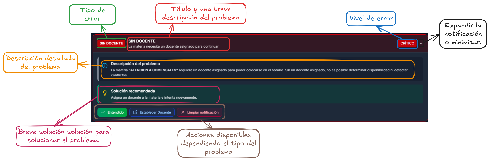

# Elaboración de horarios

## Primeros pasos

Hasta este punto para la elaboración de horarios se debió haber realizado los puntos que se mencionan en [#configuracion-del-semestre](../comenzar-interaccion.md#configuracion-del-semestre "mention"). Ya teniendo esa información disponible, nos dirigimos en el apartado de **Semestres y Horarios** en donde se estarán mostrando todos los semestres creados en el sistema. Se puede interactuar con los componentes y se pueda dar clic, lo que hará es dirigirnos a otra vista.

<figure><figcaption></figcaption></figure>

## Vista dentro del semestre

Dentro de esta vista podremos encontrar lo siguiente:

1. **Barra de búsqueda de grupos:** permite buscar cierto grupo dentro de todos los grupos registrados en el sistema.
2. **Descargar horarios:** permite la descarga de múltiples horarios dentro de este semestre.
3. **Filtrar rango:** permite solo mostrar un cierto rango de los grupos que hay en el sistema.
4. **Grupos:** muestra los grupos correspondientes para el semestre.

<figure><figcaption></figcaption></figure>

### Descargar horarios

El botón de descargar horario nos permite descargar los horarios de grupos específicos o de todos los grupos asignados al semestre.

1. Barra de búsqueda: permite buscar un grupo en especifico para poder seleccionarlo
2. Seleccionar todos: permite al selección de todos los grupos disponibles y asignados al semestre.
3. Grupos: muestra la lista de los grupos, los cuales se podrán seleccionar para su descarga.

<figure><figcaption></figcaption></figure>


**Nota:** consultar los formatos disponibles en la sección [#formatos-de-descarga](../otros/importante.md#formatos-de-descarga "mention").


### Grupos

En los grupos se nos muestra información que podría llegar a ser necesaria e importante para que así no se tenga que estar adentrando dentro de cada grupo para ver información. Para entrar al proceso de elaboración de horarios, debemos dar clic sobre uno de los grupos que se muestra y nos enviará a otra vista.

<figure><figcaption></figcaption></figure>

## Elaboración de horario

Ya estando en esta vista de elaboración de horarios nos encontramos con varias características que se estará explicando con más detalle.

<figure><figcaption></figcaption></figure>

Se muestran algunas de las acciones principales o lo que se puede hacer dentro del área de trabajo.

<figure><figcaption></figcaption></figure>

### Descargar

### Previsualizar

### Panel de materias

El panel de materia es la parte fundamental para poder trabajar durante la elaboración de horarios, por eso, se explica sus funcionalidades:

1. **Barra de búsqueda:** permite buscar una materia en especifico
2. **Actualizar información:** permite actualizar la información, útil para cuando se olvido hacer los pasos anteriores de [#configuracion-del-semestre](../comenzar-interaccion.md#configuracion-del-semestre "mention") y hay problemas de información.
3. **Materias disponibles:** muestra las materias disponibles y asociadas al grupo, la información que nos brinda es las horas por semana de la materia y su matrícula.
4. **Materias seleccionadas:** componente que se puede arrastrar hacia el área de trabajo (tabla de horario). También nos otorga información relevante como el docente asignado, matrícula y horas por semana.

<figure><figcaption></figcaption></figure>

#### Materias seleccionadas

### Validaciones

#### Error de validaciones

#### Notificación y manejo de errores

