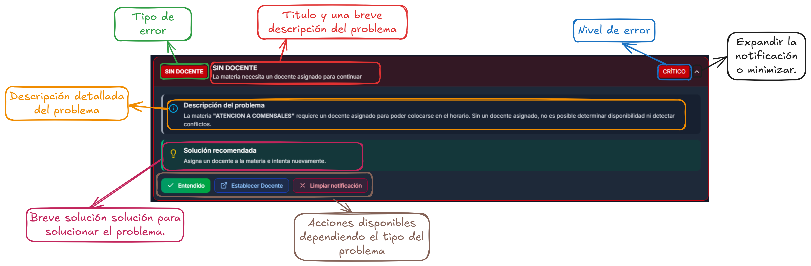

# Configuración

## Primeros pasos

En esta página se muestra la configuración que debe completarse con ciertos datos necesarios para las plantillas que se utilizarán al momento de descargar los horarios del semestre y de los docentes.

<figure><figcaption></figcaption></figure>

## Funciones principales

Las funciones principales de esta página son las siguientes:

* **Subir plantilla de horario:** permite subir una plantilla en formato  para la descarga de horarios.
* **Subir plantilla de horario final del docente:** permite subir una plantilla en formato  para la descarga del horario final de cada docente.
* **Información de encabezado:** permite registrar información importante que se incluirá en las plantillas.

### Subir plantilla de horario

Para subir una plantilla, se puede seleccionar el archivo en formato  o arrastrarlo directamente al recuadro azul.

<figure><figcaption></figcaption></figure>

Una vez seleccionado el archivo, se mostrará una opción para confirmar la subida.


**Nota:** se pueden subir tantas plantillas como se desee


<figure><figcaption></figcaption></figure>

Cuando el archivo haya finalizado su carga, se mostrará en la parte inferior de la página junto con un selector que permitirá elegir cuál será la plantilla principal.

<figure><figcaption></figcaption></figure>

### Subir plantilla de horario final docente

Para subir una plantilla del horario final del docente, se debe seleccionar el archivo en formato  y proceder con la carga.

<figure><figcaption></figcaption></figure>

Una vez seleccionado, se mostrará la opción de confirmación antes de subir el archivo.


**Nota:** se pueden subir tantas plantillas como se desee


<figure><figcaption></figcaption></figure>

Tras completarse la carga, el archivo aparecerá en la parte inferior con un selector que permitirá definir la plantilla principal.

<figure><figcaption></figcaption></figure>

### Información de encabezado de horario

En esta sección se debe completar la información necesaria e importante que será reemplazada dentro de la plantilla. Los campos requeridos son:

* Plantel
* Elaboró
* Cargo de quien elaboró
* Vo.Bo
* Cargo del Vo.Bo

<figure><figcaption></figcaption></figure>

Cuando todos los campos estén completos, el sistema permitirá guardar los cambios.
