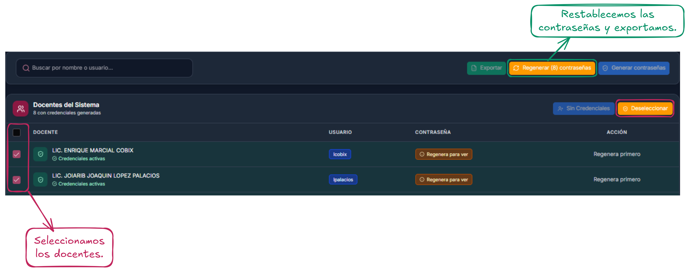

# Gestionar credenciales docente

## Primeros pasos

En esta página se consulta los usuarios y contraseñas de los docentes, el cual le estará permitiendo poder acceder al sistema para realizar sus actividades correspondientes como establecer su horario de trabajo y checar su horario final.

<figure><figcaption></figcaption></figure>

## Funciones principales

Como funciones principales tenemos:

1. **Barra de búsqueda:** permite buscar un docente en especifico para crear o regenerar su contraseña.
2. **Exportar:** permite exportar todas las credenciales visibles en un archivo .
3. **Regenerar contraseñas:** permite restablecer contraseñas de los docentes.
4. **Generar contraseñas:** permite generar por primera vez las contraseñas de los docentes.

<figure><figcaption></figcaption></figure>

### Exportar

Se podrá exportar las credenciales de los docentes al **MOMENTO** esto quiere decir que, si después de un tiempo vuelve a ingresar al apartado de credenciales deberá [#regenerar-contrasenas](gestionar-credenciales-docente.md#regenerar-contrasenas "mention")para poder exportarlas, lo que hará que las contraseñas se restablezcan.

<figure><figcaption></figcaption></figure>

Una vez generado las credenciales nos descargará un archivo  con las credenciales de los docentes

<figure><figcaption></figcaption></figure>

### Regenerar contraseñas

Para regenerar una contraseña sirve para cuando se crea un nuevo semestre, lo que garantiza mayor seguridad al inicio de cada semestre y también puede servir para crear las contraseñas en dado caso de haberlas extraviado. Para este paso, se realiza algo similar al de [#generar-contrasenas](gestionar-credenciales-docente.md#generar-contrasenas "mention").

<figure><figcaption></figcaption></figure>

### Generar contraseñas

Para poder generar las contraseñas de los docentes, primero se deberán seleccionar los docentes a los cuales se les estará creando una contraseña inicial, lo que esto permitirá es que así puedan ingresar al sistema con sus credenciales.

<figure><figcaption></figcaption></figure>

Una vez seleccionado los docentes y se haya generado sus credenciales por primera vez se estará mostrando de la siguiente manera. En donde sabremos que las contraseñas se han generado correctamente.


**Importante:** se deben descargar las contraseñas una vez se ha generado, para así evitar tener que estar regenerándolas a cada rato. Ir a [#exportar](gestionar-credenciales-docente.md#exportar "mention") para más información.


<figure><figcaption></figcaption></figure>
