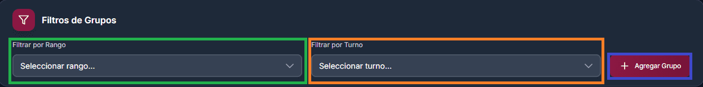
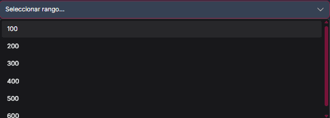
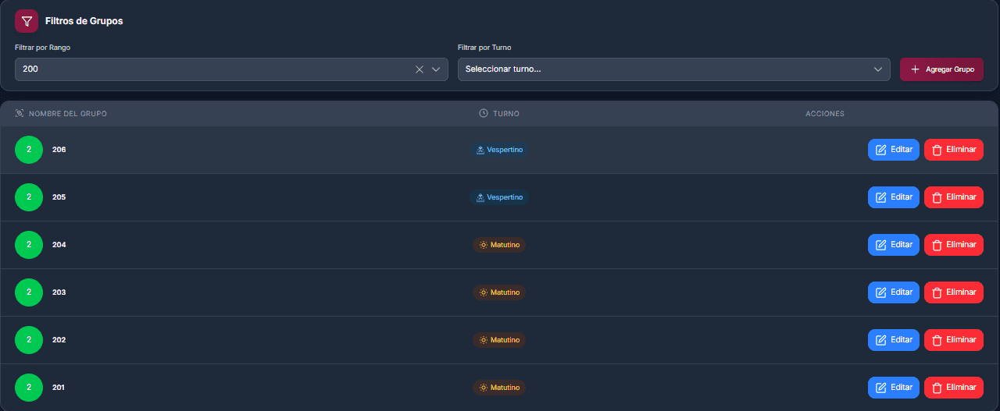
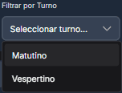
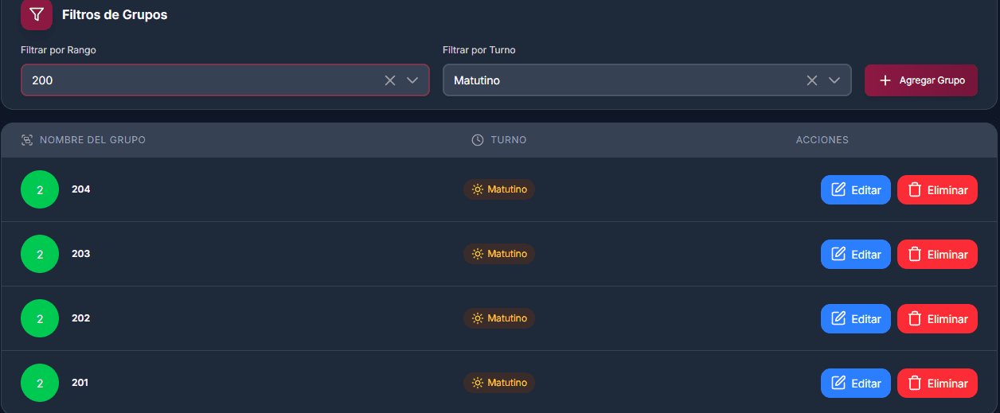
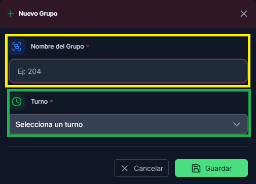
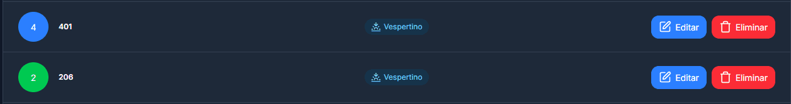
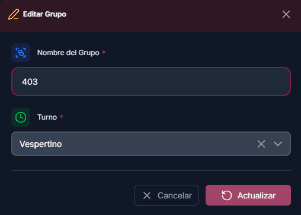
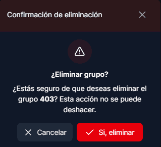

# Grupos

## Primeros pasos

Página principal donde se muestran todos los grupos registrados en el sistema. Este sería la forma inicial de cuando no se encuentra información registrada.

<figure><figcaption></figcaption></figure>

## Funciones principales

Estas herramientas son útiles para mejorar la búsqueda de los grupos y ser más rápido en el proceso.

1. <mark style="color:green;">**Filtrar por rango:**</mark> con esto será más rápido buscar ciertos grupos, por ej: 201,202,203.. con el rango 200
2. <mark style="color:orange;">**Filtrar por turno:**</mark> con este filtro se separará los grupos por tuno y si combinamos con el de rango será aun mejor, porque se obtiene cierto rango de grupos que sean de un turno en especifico.
3. <mark style="color:purple;">**Agregar grupo:**</mark> se crea un nuevo registro de grupo en el sistema.

<figure><figcaption></figcaption></figure>

### <mark style="color:green;">Filtrar por rango</mark>

En el selector tenemos diferentes valores, y estos valores van de acuerdo con los grupos, si se selecciona alguno de ellos en automático se mostrarán las materias con ese rango seleccionado.

<figure><figcaption></figcaption></figure>

En este caso se selecciono el `rango` de 200 y nos esta mostrando los grupos que entra en ese valor.

<figure><figcaption></figcaption></figure>

### <mark style="color:orange;">Filtrar por tuno</mark>

En el selector de turno es algo más sencillo, ya que solo se tiene dos valores

1. Matutino
2. Vespertino

<figure><figcaption></figcaption></figure>

Ahora, si se aplica el filtro del turno y a la vez el de rango, los valores mostrados serán menos y más precisos.

<figure><figcaption></figcaption></figure>

### <mark style="color:purple;">Agregar grupo</mark>

Para poder crear un nuevo grupo se requiere de lo siguiente.

1. <mark style="color:yellow;">**Nombre del grupo:**</mark> entre `3` y `5` caracteres
2. <mark style="color:green;">**Turno:**</mark> en el turno se despliega un selector en donde se muestran los valores `Matutino` y `Vespertino`.

<figure><figcaption></figcaption></figure>



## Información obtenida

Una vez creado el nuevo grupo, se mostrará de la siguiente manera, en donde también se podrá realizar algunas acciones.

<figure><figcaption></figcaption></figure>

### <mark style="color:blue;">Editar</mark>

Al editar un grupo, se aplican las mismas validaciones que al crear. Los campos se rellenan automáticamente con los datos actuales.

<figure><figcaption></figcaption></figure>



### <mark style="color:red;">Eliminar</mark>

Esta acción es irreversible y eliminará completamente la información de la base de datos. Lee cuidadosamente la confirmación antes de proceder.

<figure><figcaption></figcaption></figure>
