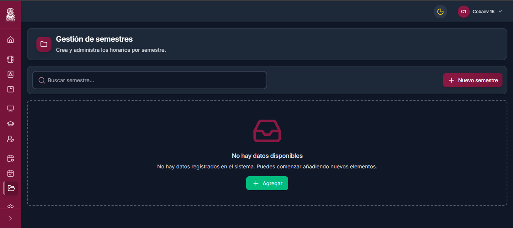

# Semestres

## Primeros pasos

La página que muestra todos los semestres creados es una parte esencial del funcionamiento del sistema.

<figure><figcaption></figcaption></figure>

## Funciones principales

En este apartado hay dos funciones principales:

1. <mark style="color:green;">**Barra de búsqueda:**</mark> permite encontrar semestres específicos, lo cual resulta útil cuando hay una gran cantidad de datos registrados.
2. <mark style="color:purple;">**Nuevo semestre:**</mark> botón que permite crear un nuevo semestre dentro del sistema.

<figure><figcaption></figcaption></figure>

### <mark style="color:$primary;">Nuevo semestre</mark>

Para crear un nuevo semestre en el sistema, se requiere la siguiente información:

* <mark style="color:green;">**Año del semestre:**</mark> se selecciona el año en curso en el que se elaborarán los horarios académicos.
* <mark style="color:purple;">**Periodo:**</mark> permite distinguir a qué periodo corresponde el semestre.
* <mark style="color:red;">**Tipo de grupos:**</mark> indica al sistema el tipo de grupos que se trabajarán durante el semestre.

<figure><figcaption></figcaption></figure>
