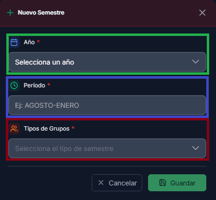
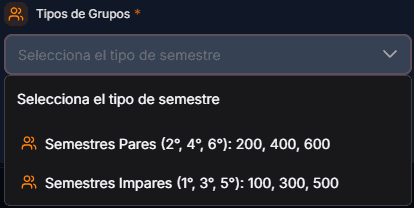
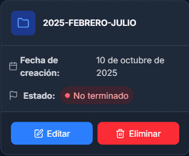
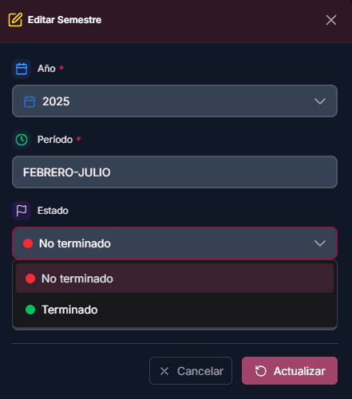
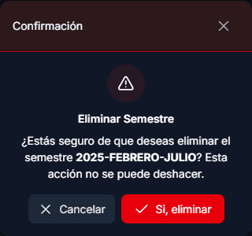

# Semestres

## Primeros pasos

La página que muestra todos los semestres creados es una parte esencial del funcionamiento del sistema.

<figure><figcaption></figcaption></figure>

## Funciones principales

En este apartado hay dos funciones principales:

1. <mark style="color:green;">**Barra de búsqueda:**</mark> permite encontrar semestres específicos, lo cual resulta útil cuando hay una gran cantidad de datos registrados.
2. <mark style="color:purple;">**Nuevo semestre:**</mark> botón que permite crear un nuevo semestre dentro del sistema.

<figure><figcaption></figcaption></figure>

### <mark style="color:$primary;">Nuevo semestre</mark>

Para crear un nuevo semestre en el sistema, se requiere la siguiente información:

* <mark style="color:green;">**Año del semestre:**</mark> se selecciona el año en curso en el que se elaborarán los horarios académicos.
* <mark style="color:purple;">**Periodo:**</mark> permite distinguir a qué periodo corresponde el semestre.
* <mark style="color:red;">**Tipo de grupos:**</mark> indica al sistema el tipo de grupos que se trabajarán durante el semestre.

<figure><figcaption></figcaption></figure>

Es importante tener en cuenta lo siguiente: existen dos valores que se muestran según el semestre que se gestione. Esto permite que cada semestre muestre únicamente los grupos correspondientes y se eviten confusiones. Por este motivo, es necesario seleccionar correctamente el tipo de grupos que se manejarán en el semestre.

<figure><figcaption></figcaption></figure>



Cada vez que se crea un nuevo semestre, se muestra una notificación en la parte superior derecha. Esta notificación recomienda acceder al apartado [#dashboard](../comenzar-interaccion.md#dashboard "mention") para conocer los pasos que deben seguirse tras la creación del semestre.

## Información obtenida

Cuando se crea un nuevo semestre, el sistema proporciona información adicional que puede resultar útil.

1. **Fecha de creación:** permite conocer la fecha en que el semestre fue creado.
2. **Estado:** indica si el semestre ha finalizado o continúa activo.

<figure><figcaption></figcaption></figure>

### <mark style="color:blue;">Editar</mark>

Al editar un semestre, se muestra un valor adicional que no aparece al crearlo en [#nuevo-semestre](semestres.md#nuevo-semestre "mention").

* <mark style="color:orange;">**Estado**</mark>**:** permite marcar si el semestre ha finalizado o no, lo cual es importante para [planificacion-docente.md](../gestion-de-horarios/planificacion-docente.md "mention").

<figure><figcaption></figcaption></figure>

#### <mark style="color:red;">Eliminar</mark>

Esta acción es irreversible y eliminará completamente la información de la base de datos. Lee cuidadosamente la confirmación antes de proceder.

<figure><figcaption></figcaption></figure>
