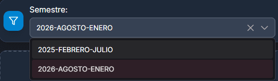

# Docentes con materias

## Primeros pasos

La asociación de los docentes con la materia que impartirá durante el semestre nos permite hacer un mejor manejo del sistema, ya que con estas relaciones podremos tener la información más completa para el horario final del docente.

<figure><figcaption></figcaption></figure>



## Funciones principales

1. <mark style="color:green;">**Barra de búsqueda:**</mark> busca las relaciones existentes mediante el nombre del docente o por materia.
2. <mark style="color:orange;">**Filtrar por semestre:**</mark> muestra las relaciones del semestre seleccionado.
3. <mark style="color:$primary;">**Nueva relación:**</mark> crea una nueva asociación para docentes con las materias.

<figure><figcaption></figcaption></figure>

### <mark style="color:orange;">Filtrar semestre</mark>

Cuando se desea mostrar únicamente las relaciones del semestre actual o de algún otro semestre

<figure><figcaption></figcaption></figure>

### <mark style="color:$primary;">Nueva relación entre materia y docente</mark>

Antes de crear una relación, asegúrate tener:

* [#nuevo-semestre](../recursos-academica/semestres.md#nuevo-semestre "mention")
* [#nuevo-docente](../recursos-academica/docentes.md#nuevo-docente "mention")
* [#nueva-materia](../recursos-academica/materias.md#nueva-materia "mention")

Los campos principales de esta relación son las siguientes:

1. <mark style="color:orange;">**Semestre:**</mark> seleccionar el semestre.
2. <mark style="color:green;">**Docente:**</mark> seleccionar uno o varios docentes.
3. <mark style="color:blue;">**Materia:**</mark> seleccionar una o varias materias.

<figure><figcaption></figcaption></figure>

Para realizar la asociación:

* Selecciona el semestre al que aplicarás la asociación (normalmente se trabaja con el más reciente).
* Selecciona uno o varios docentes y materias; la selección múltiple permite asociar varias materias a un docente o varios docentes a una materia.

<figure><figcaption></figcaption></figure>



## Información obtenida

Las asociaciones creadas se muestran en una lista con la información necesaria para identificarlas.

<figure><figcaption></figcaption></figure>

### <mark style="color:blue;">Editar</mark>

La edición de una asociación es individual; no está disponible la selección múltiple. Utiliza esta opción para ajustar datos específicos de un registro.

<figure><figcaption></figcaption></figure>



### <mark style="color:red;">Eliminar</mark>

Esta acción es irreversible y eliminará completamente la información de la base de datos. Lee cuidadosamente la confirmación antes de proceder.

<figure><figcaption></figcaption></figure>
