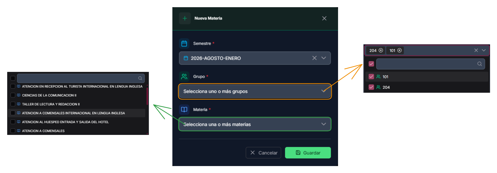

# Materias con grupos

## Primeros pasos

Las relaciones entre materias y grupos son esenciales: permiten asignar las materias correctas al elaborar horarios y evitan saturar la interfaz con todas las materias registradas.

<figure><figcaption></figcaption></figure>


Es importante crear estas relaciones cada vez que se inicia un nuevo semestre, ya que las asignaciones pueden cambiar. Consulta [#configuracion-del-semestre](../comenzar-interaccion.md#configuracion-del-semestre "mention") para más información.


## Funciones principales

1. <mark style="color:purple;">**Filtro de semestre:**</mark> muestra los semestres registrados.
2. <mark style="color:red;">**Filtro de grupos:**</mark> muestra los grupos disponibles.
3. <mark style="color:green;">**Nueva relación:**</mark> crear una asociación entre materia y grupo.

<figure><figcaption></figcaption></figure>

### <mark style="color:purple;">Filtrar por semestre</mark>

El selector de semestre muestra todos los semestres disponibles. Al aplicar este filtro verás las asociaciones de materias con grupos correspondientes al semestre seleccionado.

<figure><figcaption></figcaption></figure>

### <mark style="color:red">Filtrar por grupos</mark>

El filtro por grupos muestra las asociaciones entre materias y grupos. Si además aplicas el filtro de semestre, se mostrarán solo las asociaciones de ese semestre.

<figure><figcaption></figcaption></figure>

### <mark style="color:green;">Nueva relación entre materia y grupo</mark>

Antes de crear una relación, asegúrate de tener:

- [#nuevo-semestre](../recursos-academica/semestres.md#nuevo-semestre "mention")
- [#agregar-grupo](../recursos-academica/grupos.md#agregar-grupo "mention")
- [#nueva-materia](../recursos-academica/materias.md#nueva-materia "mention")

Campos principales del formulario:

1. <mark style="color:red;">**Semestre:**</mark> seleccionar el semestre.
2. <mark style="color:green;">**Grupo:**</mark> seleccionar uno o varios grupos.
3. <mark style="color:purple;">**Materia:**</mark> seleccionar una o varias materias.

<figure><figcaption></figcaption></figure>

Para realizar la asociación:

- Selecciona el semestre al que aplicarás la asociación (normalmente se trabaja con el más reciente).
- Selecciona uno o varios grupos y materias; la selección múltiple permite asociar varias materias a un grupo o varios grupos a una materia.

<figure><figcaption></figcaption></figure>



## Información obtenida

Las asociaciones creadas se muestran en una lista con la información necesaria para identificarlas.

<figure><figcaption></figcaption></figure>

### <mark style="color:blue;">Editar</mark>

La edición de una asociación es individual; no está disponible la selección múltiple. Utiliza esta opción para ajustar datos específicos de un registro.

<figure><figcaption></figcaption></figure>

### <mark style="color:red;">Eliminar</mark>

Esta acción es irreversible: eliminará el registro de la base de datos. Lee la confirmación antes de proceder.

<figure><figcaption></figcaption></figure>
